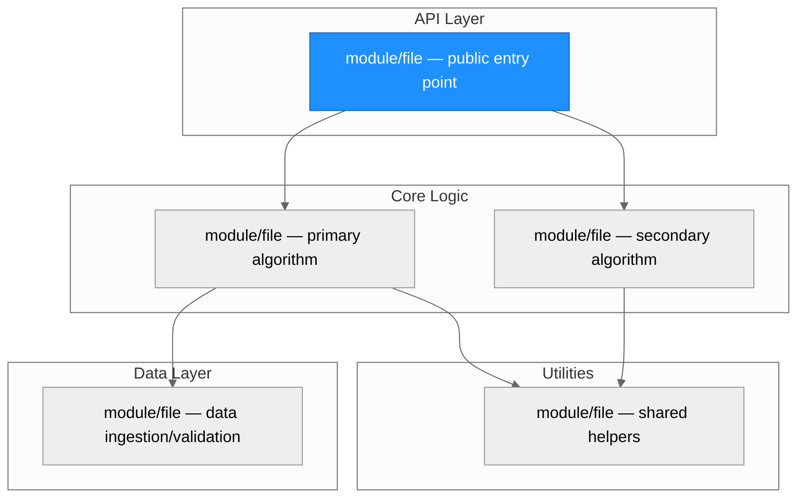
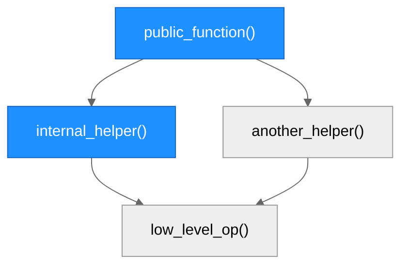
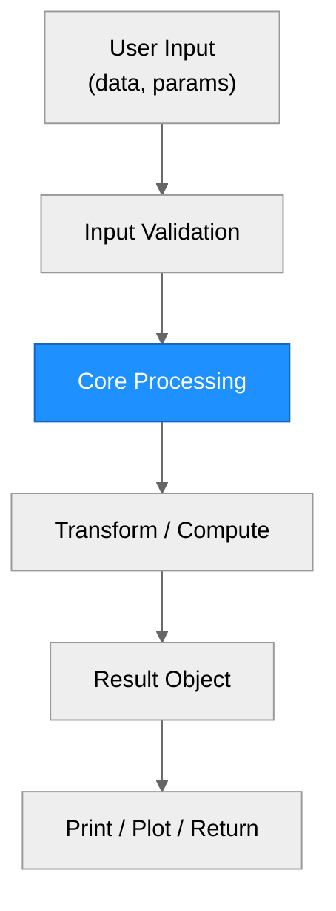

# Architecture — [Package Name]

> Generated by scribe for run `[request-id]` on [YYYY-MM-DD].

## Overview

[One paragraph summarizing the repository's purpose, primary abstraction, and overall design approach. State the language, framework, and key external dependencies.]

---

## Module Structure

> Nodes with blue fill indicate modules modified in this run.

### Module Reference

| Module / File | Layer | Purpose | Key Exports | Changed |
| --- | --- | --- | --- | --- |
| `[path]` | API | [purpose] | `[functions]` | yes / no |
| `[path]` | Core | [purpose] | `[functions]` | yes / no |
| `[path]` | Data | [purpose] | `[functions]` | yes / no |
| `[path]` | Utils | [purpose] | `[functions]` | yes / no |

---

## Function Call Graph

> Shows call chains for functions affected by this run. Blue nodes = changed. Trace from public entry points down to leaf operations.

### Function Reference

| Function | Defined In | Called By | Calls | Changed | Purpose |
| --- | --- | --- | --- | --- | --- |
| `public_function()` | `[file]` | user / exported | `internal_helper`, `another_helper` | yes / no | [one-line purpose] |
| `internal_helper()` | `[file]` | `public_function` | `low_level_op` | yes / no | [one-line purpose] |

---

## Data Flow

> Top-to-bottom flow showing how data moves through the system from input to output. Blue nodes = changed in this run.

---

## Architectural Patterns

[Bullet list of patterns observed in the codebase. Examples:]

- **[Pattern name]**: [where it appears and why it matters]

---

## Notes

- [Any observations about code organization, technical debt, or design decisions relevant to the current run.]
