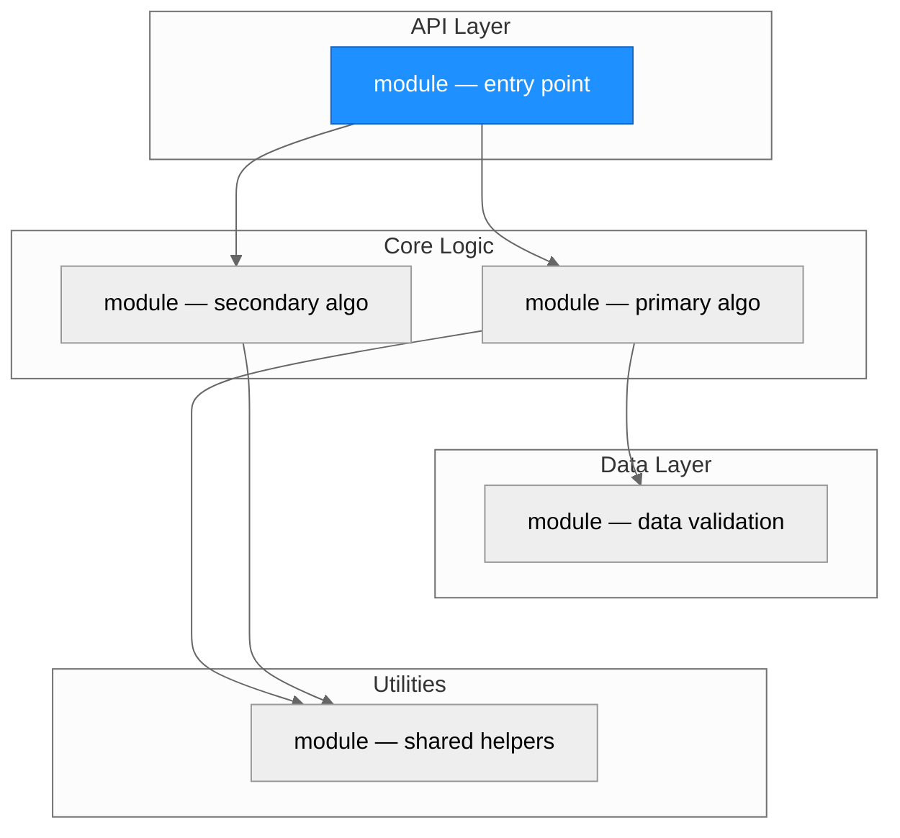
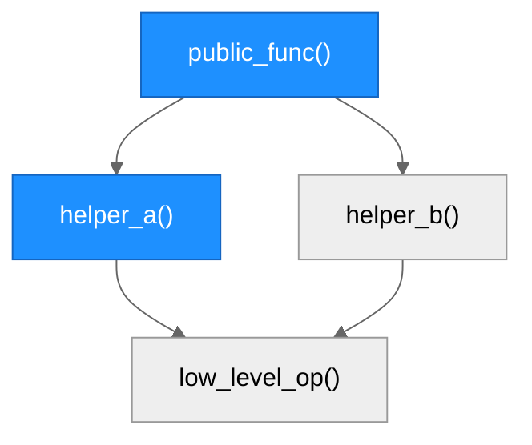
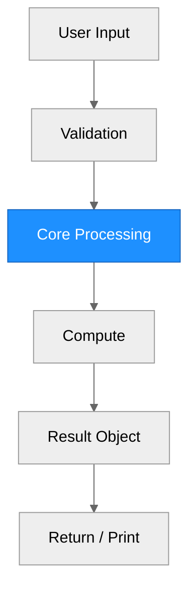

# Architecture — [Package Name]

> Generated by scribe for run `[request-id]` on [YYYY-MM-DD].

## Overview

[One paragraph summarizing the repository's purpose, primary abstraction, and overall design approach. State the language, framework, and key external dependencies.]

---

## Module Structure

<!--
  LAYOUT RULES:
  - Max 3 nodes per horizontal row
  - Subgraphs MUST stack vertically (use ~~~ invisible edges)
  - If >20 nodes total, split into multiple diagrams (one per layer)
  - Diagram MUST be taller than it is wide when rendered
-->

> Blue fill = modified in this run. Subgraphs are stacked vertically by layer.

### Module Reference

| Module / File | Layer | Purpose | Key Exports | Changed |
| --- | --- | --- | --- | --- |
| `[path]` | API | [purpose] | `[functions]` | yes / no |
| `[path]` | Core | [purpose] | `[functions]` | yes / no |
| `[path]` | Data | [purpose] | `[functions]` | yes / no |
| `[path]` | Utils | [purpose] | `[functions]` | yes / no |

---

## Function Call Graph

<!--
  LAYOUT RULES:
  - Max 3 nodes per horizontal row
  - If a node has >3 children, use invisible routing nodes to split into rows
  - Keep the graph narrow and tall
-->

> Blue nodes = changed. Trace from public entry points down to leaf operations. Max 3 nodes per row.

### Function Reference

| Function | Defined In | Called By | Calls | Changed | Purpose |
| --- | --- | --- | --- | --- | --- |
| `public_func()` | `[file]` | user / exported | `helper_a`, `helper_b` | yes / no | [one-line] |
| `helper_a()` | `[file]` | `public_func` | `low_level_op` | yes / no | [one-line] |

---

## Data Flow

<!--
  LAYOUT RULES:
  - MUST be a single vertical chain (graph TD)
  - NEVER horizontal (graph LR)
  - Branches rejoin quickly (max 2 nodes wide)
-->

> Vertical chain from input to output. Blue nodes = changed in this run.

---

## Architectural Patterns

[Bullet list of patterns observed in the codebase. Examples:]

- **[Pattern name]**: [where it appears and why it matters]

---

## Notes

- [Any observations about code organization, technical debt, or design decisions relevant to the current run.]
